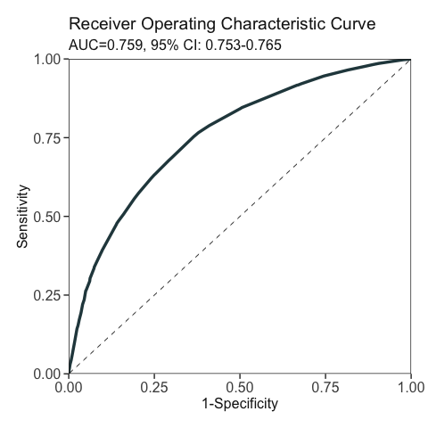
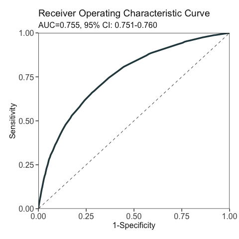

<!-- badges: start -->

[](https://arxiv.org/abs/2201.03291)
<!-- badges: end -->

AutoScore-ShapleyVIC: A Novel Interpretable Machine Learning System to
Generate Clinical Risk Scores
================

-   [AutoScore-ShapleyVIC
    Introduction](#autoscore-shapleyvic-introduction)
    -   [Description](#description)
    -   [Citation](#citation)
-   [Example: Prediction of Early Mortality or Unplanned
    Readmission](#example-prediction-of-early-mortality-or-unplanned-readmission)
    -   [Load R packages](#load-r-packages)
    -   [Step 1: Prepare training, validation and test
        datasets](#step-1-prepare-training-validation-and-test-datasets)
    -   [Step 2: Variable ranking from ShapleyVIC analysis of nearly
        optimal
        models](#step-2-variable-ranking-from-shapleyvic-analysis-of-nearly-optimal-models)
    -   [Step 3: Model development using ShapleyVIC-based ranking and
        AutoScore
        workflow](#step-3-model-development-using-shapleyvic-based-ranking-and-autoscore-workflow)

# AutoScore-ShapleyVIC Introduction

## Description

Risk scores are widely used for clinical decision making and commonly
generated from logistic regression models. Machine-learning-based
methods may work well for identifying important predictors to create
parsimonious scores, but such ‘black box’ variable selection limits
interpretability, and variable importance evaluated from a single model
can be biased. We propose a robust and interpretable variable selection
approach using ShapleyVIC, and integrate it with the AutoScore framework
for convenient development of risk scoring models.

In this document, we describe the application of the
AutoScore-ShapleyVIC workflow using an empirical example, where we
develop a prediction model for the risk of a binary outcome, 30-day
readmission or death, from 41 candidate variables.

## Citation

Ning Y, Li S, Ong ME, Xie F, Chakraborty B, Ting DS, Liu N. A novel
interpretable machine learning system to generate clinical risk scores:
An application for predicting early mortality or unplanned readmission
in a retrospective cohort study. *arXiv preprint* arXiv:2201.03291
(<https://arxiv.org/abs/2201.03291>)

# Example: Prediction of Early Mortality or Unplanned Readmission

Code below reproduces Model 2 described in the cited paper.

## Load R packages

``` r
library(car) # For VIF analysis of optimal model (needed for ShapleyVIC analysis)
library(AutoScore)
library(ShapleyVIC)
library(tidyverse) # For convenient data manipulation and visualization
library(magrittr) # For convenient data manipulation
library(knitr)
```

## Step 1: Prepare training, validation and test datasets

Use the `split_data()` function of the AutoScore package to split data,
and perform median imputation for vital signs and lab tests based on
training set.

``` r
# Read the final clean data with 41 candidate variables and the binary outcome (`label`):
dat <- readRDS("dat_readmit_or_death.RDS")
set.seed(1234)
Out_split <- split_data(data = dat, ratio = c(7, 1, 2))
# Median imputation for vital signs and lab tests based on training set:
train_lab_test <- Out_split$train_set %>% select(Pulse:SODIUM)
train_lab_test_median <- apply(train_lab_test, 2, function(x) median(x, na.rm = TRUE))
Out_split <- lapply(Out_split, function(dat) {
  for (nm in names(train_lab_test)) {
    dat[, nm] <- ifelse(is.na(dat[, nm]), train_lab_test_median[nm], dat[, nm])
  }
  dat
})
x_names_display <- c(
  "Age", "Gender", "Race", "ED LOS", "ED triage", 
  "ED boarding time", "Consultation waiting time", "No. ED visit", 
  "Day of week", "Inpatient LOS", "Ventilation", "Resuscitation", 
  "No. surgery", "No. ICU stay", 
  "No. HD stay", "Pulse", "Respiration", "SpO2", 
  "DBP", "SBP", "Bicarbonate", "Creatinine", 
  "Potasium", "Sodium", "MI", "CHF", "PVD", "Stroke", 
  "Dementia", "Pulmonary", "Rheumatic", "PUD", "Mild liver disease", 
  "Diabetes", "Diabetes with complications", "Paralysis", "Renal", "Cancer", 
  "Severe liver disease", "Metastatic cancer", "Admission type"
)
names(Out_split$train_set) <- c("label", var_names$new)
names(Out_split$validation_set) <- c("label", var_names$new)
names(Out_split$test_set) <- c("label", var_names$new)
```

## Step 2: Variable ranking from ShapleyVIC analysis of nearly optimal models

**Firstly, train the optimal logistic regression model and perform VIF
analysis.**

``` r
m_optim_r <- glm(label ~ ., data = Out_split$train_set, family = "binomial")
var_vif <- vif(m_optim_r)[, 1]
# Also create a python version of optimal model for later use:
m_optim <- logit_model_python(x_train = Out_split$train_set[, x_names_display], 
                              y_train = Out_split$train_set$label)
```

**Next, generate a random set of 350 nearly optimal models.**

``` r
set.seed(1234)
df_models <- draw_models(coef_optim = coef(m_optim_r), 
                         coef_optim_var = vcov(m_optim_r), 
                         x = Out_split$train_set[, x_names_display],
                         y = Out_split$train_set$label, 
                         M = 800, u1 = 0.2, u2 = 300, n_final = 350)
```

<!-- -->

Parameters `u1` and `u2` need tuning:

-   `u1` usually takes a small value around 0.5.
-   `u2` can take a large value (probably >100) for large data.

As detailed in the Methods section of [the ShapleyVIC
paper](https://doi.org/10.1016/j.patter.2022.100452), these two values
can be selected via grid search, using a smaller size of initial sample
(e.g., `M = 100`) to reduce run time. Select values of `u1` and `u2`
such that:

1.  Around 75% of initial samples were eligible.
2.  The range of 1-1.05 times of minimum loss is well represented in the
    eligible models (see histogram above, generated by `draw_models()`).

*We are developing a function to automatically tune parameters `u1` and
`u2` for users’ convenience.*

**Finally, compute ShapleyVIC values from the nearly optimal models
generated above.**

Use the first 3500 observations in the validation set to compute
ShapleyVIC values. This step will be time consuming, and users are
recommended to use parallel computing if the computer used has multiple
cores (using the `n_cores` parameter).

To check the number of cores available, use the following code:

``` r
library(parallel)
n_cores_total = detectCores(logical = TRUE)
```

The appropriate number of cores to use depends on the total memory
available and the total number of variables. Users may start with
`n_cores = floor(n_cores_total / 2)`, inspect the total % of CPU taken
up, and increase/decrease `n_cores` such that about 80% CPU is taken up.
As an example, we used 10 out of 40 cores in this analysis with 41
candidate variables.

``` r
set.seed(1234)
df_shapley_vic <- compute_shapley_vic(
  model_py = m_optim, var_vif = var_vif, var_vif_threshold = 2,
  coef_mat = df_models[, setdiff(names(df_models), "perf_metric")], 
  perf_metric = df_models$perf_metric, 
  x_test = Out_split$validation_set[1:3500, x_names_display], 
  y_test = Out_split$validation_set$label[1:3500], 
  output_folder = "shapley_vic_output", # Results for each model is saved to this folder
  n_cores = 10 
)
```

Users are recommended to save outputs from individual models to a folder
for backup purpose, by using the `output_folder` parameter.

Too few subjects had ventilation, such that ShapleyVIC values and
standard deviation are al 0 for this variable in all 350 nearly optimal
model. Therefore, exclude ventilation from subsequent analysis.

``` r
df_shapley_vic %>% filter(var_names == "Ventilation") %>% summary()
##     model_id       var_names         sage_value_unadjusted    sage_sd 
##  Min.   :  1.00   Length:350         Min.   :0             Min.   :0  
##  1st Qu.: 88.25   Class :character   1st Qu.:0             1st Qu.:0  
##  Median :175.50   Mode  :character   Median :0             Median :0  
##  Mean   :175.50                      Mean   :0             Mean   :0  
##  3rd Qu.:262.75                      3rd Qu.:0             3rd Qu.:0  
##  Max.   :350.00                      Max.   :0             Max.   :0  
##  shapley_vic_val  perf_metric   
##  Min.   :0       Min.   :1.000  
##  1st Qu.:0       1st Qu.:1.014  
##  Median :0       Median :1.025  
##  Mean   :0       Mean   :1.025  
##  3rd Qu.:0       3rd Qu.:1.037  
##  Max.   :0       Max.   :1.050
df_shapley_vic <- df_shapley_vic %>% filter(var_names != "Ventilation")
```

Before proceeding to develop scoring models, users can summarize and
visualize the ShapleyVIC values to assess the contribution of the 41
candidate variables to the outcome.

``` r
df_shapley_vic_bar <- df_shapley_vic %$% summarise_shapley_vic(
  val = shapley_vic_val, val_sd = sage_sd, var_names = var_names
)
df_shapley_vic_bar %$% draw_bars(
  val = val, val_lower = val_lower, val_upper = val_upper, var_names = Variable
) 
```


``` r
df_shapley_vic %$% draw_violins(
  var_names = var_names, 
  var_ordering = levels(df_shapley_vic_bar$Variable),
  val = shapley_vic_val, perf_metric = perf_metric
)
```


## Step 3: Model development using ShapleyVIC-based ranking and AutoScore workflow

**Firstly, generate ensemble variable ranking from ShapleyVIC.**

``` r
val_ranks <- df_shapley_vic %$% rank_variables(
  val = shapley_vic_val, val_sd = sage_sd, model_id = model_id, var_names = var_names, 
  summarise = TRUE, ties.method = "min"
) %>% arrange(mean_rank)
```

**Next, exclude variables with non-significant overall importance (based
on the 95% prediction interval of average ShapleyVIC values).**

``` r
df_shapley_vic_bar_sig <- df_shapley_vic_bar %>% filter(val_lower > 0)
val_ranks2 <- val_ranks %>% 
  filter(Variable %in% df_shapley_vic_bar_sig$Variable)
var_ranking_svic_vec2 <- val_ranks2$mean_rank
# Make variable name match with data
names(var_ranking_svic_vec2) <- val_ranks2$Variable
```

**Finally, derive Model 2 using the AutoScore workflow.**

``` r
auc_svic2 <- AutoScore_parsimony(
  train_set = Out_split$train_set, validation_set = Out_split$validation_set, 
  rank = var_ranking_svic_vec2, n_max = length(var_ranking_svic_vec2), 
  categorize = "quantile"
)
## Select 1 Variable(s):  Area under the curve: 0.6811
## Select 2 Variable(s):  Area under the curve: 0.706
## Select 3 Variable(s):  Area under the curve: 0.7406
## Select 4 Variable(s):  Area under the curve: 0.7467
## Select 5 Variable(s):  Area under the curve: 0.7555
## Select 6 Variable(s):  Area under the curve: 0.7589
## Select 7 Variable(s):  Area under the curve: 0.7595
## Select 8 Variable(s):  Area under the curve: 0.7605
## Select 9 Variable(s):  Area under the curve: 0.7624
## Select 10 Variable(s):  Area under the curve: 0.7637
## Select 11 Variable(s):  Area under the curve: 0.765
## Select 12 Variable(s):  Area under the curve: 0.7674
## Select 13 Variable(s):  Area under the curve: 0.7696
## Select 14 Variable(s):  Area under the curve: 0.7708
## Select 15 Variable(s):  Area under the curve: 0.7708
## Select 16 Variable(s):  Area under the curve: 0.7713
## Select 17 Variable(s):  Area under the curve: 0.7713
## Select 18 Variable(s):  Area under the curve: 0.7712
## Select 19 Variable(s):  Area under the curve: 0.7713
## Select 20 Variable(s):  Area under the curve: 0.7715
## Select 21 Variable(s):  Area under the curve: 0.7718
## Warning: Use of `dt$num` is discouraged. Use `num` instead.
```


Build Model 2 using top 6 variables:

``` r
var_final2 <- val_ranks2$Variable[1:6]
```

Automatically determine cut-off values to categorize continuous
predictors:

``` r
var_cut_vec2 <- AutoScore_weighting(
  train_set = Out_split$train_set, validation_set = Out_split$validation_set,
  final_variables = var_final2
)
## ****Included Variables: 
##       variable_name
## 1      No. ED visit
## 2 Metastatic cancer
## 3               Age
## 4            Sodium
## 5             Renal
## 6         ED triage
## ****Initial Scores: 
## 
## 
## =================  =========  =====
## variable           interval   point
## =================  =========  =====
## No. ED visit       <1           0  
##                    [1,3)       14  
##                    >=3         32  
##                                    
## Metastatic cancer  0            0  
##                    1           22  
##                                    
## Age                <28          0  
##                    [28,46)      5  
##                    [46,78)     11  
##                    [78,87)     14  
##                    >=87        19  
##                                    
## Sodium             <126        11  
##                    [126,132)    8  
##                    [132,138)    3  
##                    [138,141)    0  
##                    >=141        3  
##                                    
## Renal              0            0  
##                    1            8  
##                                    
## ED triage          P1           8  
##                    P2           5  
##                    P3 and P4    0  
## =================  =========  =====
```

<!-- -->

    ## ***Performance (based on validation set):
    ## AUC:  0.7589   95% CI: 0.7525-0.7654 (DeLong)
    ## Best score threshold: >= 27 
    ## Other performance indicators based on this score threshold: 
    ## Sensitivity: 0.7546 95% CI: 0.7436-0.7654
    ## Specificity: 0.6337 95% CI: 0.6283-0.6389
    ## PPV:         0.2887 95% CI: 0.2845-0.2929
    ## NPV:         0.9291 95% CI: 0.9261-0.932
    ## ***The cutoffs of each variable generated by the AutoScore are saved in cut_vec. You can decide whether to revise or fine-tune them

Generate scoring table for the current model:

``` r
score_list2 <- AutoScore_fine_tuning(
  train_set = Out_split$train_set, validation_set = Out_split$validation_set,
  final_variables = var_final2, cut_vec = var_cut_vec2
)
## ***Fine-tuned Scores: 
## 
## 
## =================  =========  =====
## variable           interval   point
## =================  =========  =====
## No. ED visit       <1           0  
##                    [1,3)       14  
##                    >=3         32  
##                                    
## Metastatic cancer  0            0  
##                    1           22  
##                                    
## Age                <28          0  
##                    [28,46)      5  
##                    [46,78)     11  
##                    [78,87)     14  
##                    >=87        19  
##                                    
## Sodium             <126        11  
##                    [126,132)    8  
##                    [132,138)    3  
##                    [138,141)    0  
##                    >=141        3  
##                                    
## Renal              0            0  
##                    1            8  
##                                    
## ED triage          P1           8  
##                    P2           5  
##                    P3 and P4    0  
## =================  =========  =====
```

<!-- -->

    ## ***Performance (based on validation set, after fine-tuning):
    ## AUC:  0.7589   95% CI: 0.7525-0.7654 (DeLong)
    ## Best score threshold: >= 27 
    ## Other performance indicators based on this score threshold: 
    ## Sensitivity: 0.7546 95% CI: 0.7435-0.7654
    ## Specificity: 0.6339 95% CI: 0.6285-0.6391
    ## PPV:         0.2888 95% CI: 0.2847-0.2932
    ## NPV:         0.9291 95% CI: 0.9261-0.932

Evaluate current model on the test set:

``` r
pred_score2 <- AutoScore_testing(
  test_set = Out_split$test_set, final_variables = var_final2, 
  cut_vec = var_cut_vec2, scoring_table = score_list2
)
```

<!-- -->

    ## ***Performance using AutoScore:
    ## AUC:  0.756   95% CI: 0.7514-0.7605 (DeLong)
    ## Best score threshold: >= 29 
    ## Other performance indicators based on this score threshold: 
    ## Sensitivity: 0.6759 95% CI: 0.6677-0.6839
    ## Specificity: 0.7047 95% CI: 0.7011-0.7081
    ## PPV:         0.3106 95% CI: 0.3069-0.3142
    ## NPV:         0.917 95% CI: 0.915-0.9189

Fine-tune the cut-off values for continuous predictors for preferable
interpretation:

``` r
var_cut_vec2_2 <- var_cut_vec2
var_cut_vec2_2$Age <- c(25, 45, 75, 85)
var_cut_vec2_2$Sodium <- c(125, 130, 135, 140)
```

Update scoring table:

``` r
score_list2_2 <- AutoScore_fine_tuning(
  train_set = Out_split$train_set, validation_set = Out_split$validation_set,
  final_variables = var_final2, cut_vec = var_cut_vec2_2
)
## ***Fine-tuned Scores: 
## 
## 
## =================  =========  =====
## variable           interval   point
## =================  =========  =====
## No. ED visit       <1           0  
##                    [1,3)       14  
##                    >=3         33  
##                                    
## Metastatic cancer  0            0  
##                    1           21  
##                                    
## Age                <25          0  
##                    [25,45)      4  
##                    [45,75)     12  
##                    [75,85)     15  
##                    >=85        19  
##                                    
## Sodium             <125        10  
##                    [125,130)    7  
##                    [130,135)    4  
##                    [135,140)    0  
##                    >=140        0  
##                                    
## Renal              0            0  
##                    1            8  
##                                    
## ED triage          P1           9  
##                    P2           6  
##                    P3 and P4    0  
## =================  =========  =====
```

<!-- -->

    ## ***Performance (based on validation set, after fine-tuning):
    ## AUC:  0.7591   95% CI: 0.7527-0.7655 (DeLong)
    ## Best score threshold: >= 28 
    ## Other performance indicators based on this score threshold: 
    ## Sensitivity: 0.7178 95% CI: 0.7064-0.7286
    ## Specificity: 0.6669 95% CI: 0.6616-0.6723
    ## PPV:         0.2981 95% CI: 0.2935-0.3026
    ## NPV:         0.923 95% CI: 0.9201-0.9258

Evaluate final model on the test set:

``` r
pred_score2_2 <- AutoScore_testing(
  test_set = Out_split$test_set, final_variables = var_final2, 
  cut_vec = var_cut_vec2_2, scoring_table = score_list2_2
)
```

<!-- -->

    ## ***Performance using AutoScore:
    ## AUC:  0.7555   95% CI: 0.7509-0.76 (DeLong)
    ## Best score threshold: >= 31 
    ## Other performance indicators based on this score threshold: 
    ## Sensitivity: 0.6603 95% CI: 0.6519-0.6684
    ## Specificity: 0.7196 95% CI: 0.7162-0.7231
    ## PPV:         0.3167 95% CI: 0.3129-0.3205
    ## NPV:         0.915 95% CI: 0.913-0.9168

Fine-tuning of cut-off values has little impact on model performance,
but improves the interpretation of the final model.
