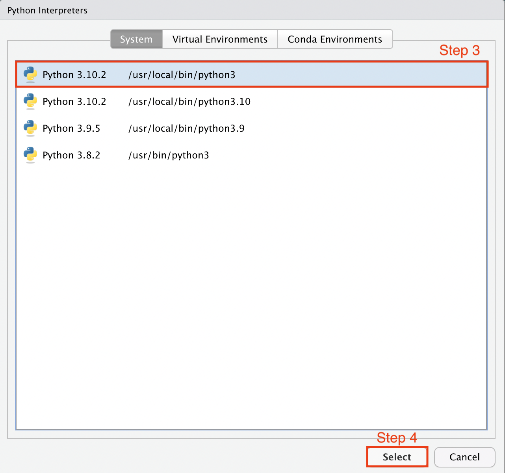
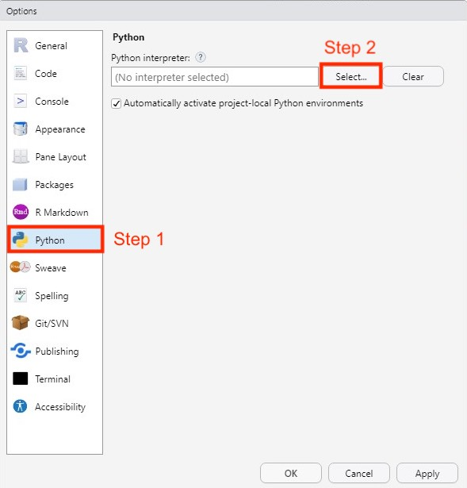
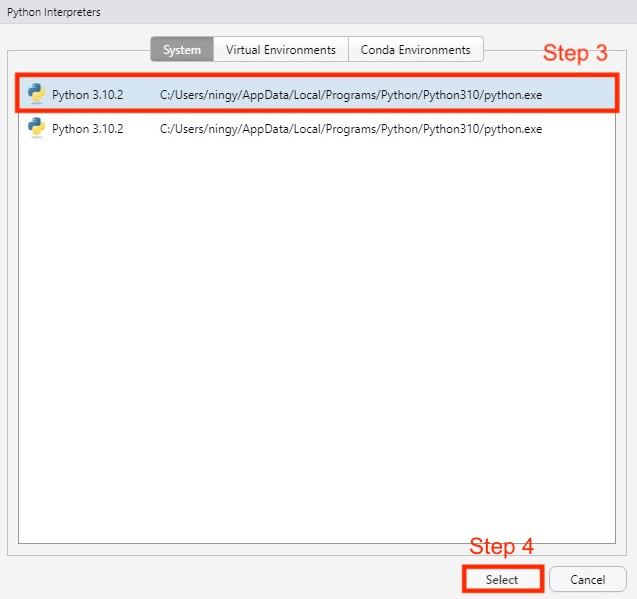
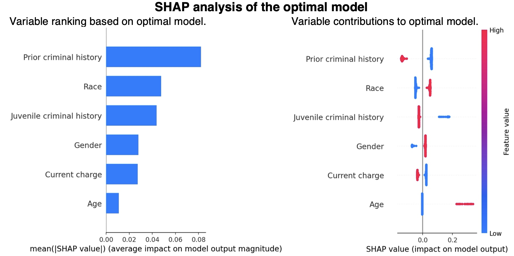
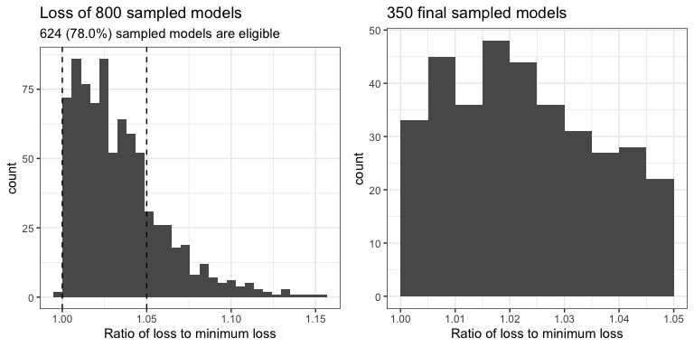
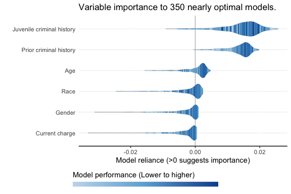
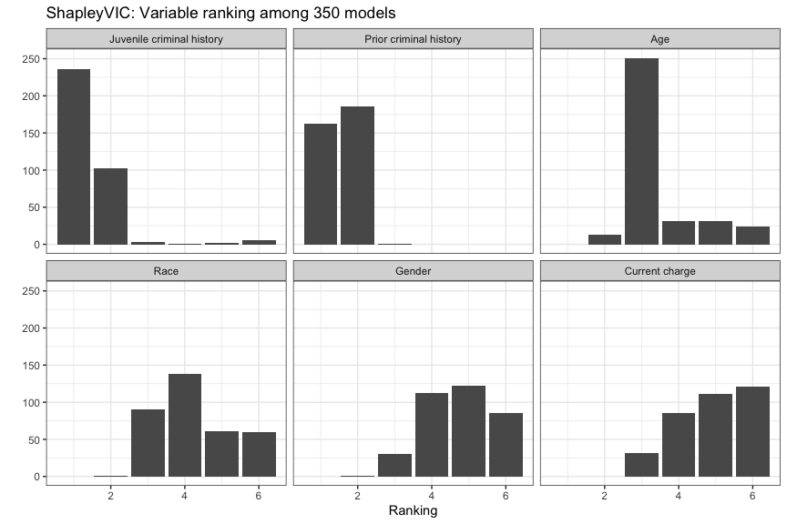

<!-- badges: start -->

[](https://doi.org/10.1016/j.patter.2022.100452)
<!-- badges: end -->

ShapleyVIC: Shapley Variable Importance Cloud for Interpretable Machine
Learning
================

-   [ShapleyVIC Introduction](#shapleyvic-introduction)
    -   [Description](#description)
    -   [Citation](#citation)
    -   [Derivative works](#derivative-works)
        -   [AutoScore-ShapleyVIC workflow](#autoscore-shapleyvic-framework-for-interpretable-development-of-clinical-risk-scores)   
    -   [Contact](#contact)
-   [Install Package and Prepare
    Data](#install-package-and-prepare-data)
    -   [Install the package from
        GitHub](#install-the-package-from-github)
    -   [Python Setup](#python-setup)
        -   [For Mac users](#for-mac-users)
        -   [For Windows 10 users](#for-windows-10-users)
    -   [Load R packages](#load-r-packages)
    -   [Load data](#load-data)
-   [ShapleyVIC Demo: Recidivism Prediction
    Study](#shapleyvic-demo-recidivism-prediction-study)
    -   [Prepare training and test
        datasets](#prepare-training-and-test-datasets)
    -   [Train optimal logistic regression
        model](#train-optimal-logistic-regression-model)
    -   [SHAP analysis of optimal
        model](#shap-analysis-of-optimal-model)
    -   [Generate nearly optimal logistic regression
        models](#generate-nearly-optimal-logistic-regression-models)
    -   [ShapleyVIC analysis of nearly optimal
        models](#shapleyvic-analysis-of-nearly-optimal-models)

# ShapleyVIC Introduction

-   GitHub Package (version 1.0.1)
    -   2022.2.24: Updated to version 1.0.1 to change in default options
        in latest meta package; added a function to install required
        Python libraries.

## Description

Variable importance assessment is important for interpreting machine
learning models. Current practice in interpretable machine learning
applications focuses on explaining the final models that optimize
predictive performance. However, this does not fully address practical
needs, where researchers are willing to consider models that are “good
enough” but are easier to understand or implement. Shapley variable
importance cloud (ShapleyVIC) fills this gap by extending current method
to a set of “good models” for comprehensive and robust assessments.
Building on a common theoretical basis (i.e., Shapley values for
variable importance), ShapleyVIC seamlessly complements the widely
adopted SHAP assessments of a single final model to avoid biased
inference.

<div class="figure" style="text-align: center">


</div>

The application of ShapleyVIC consists of 3 general steps:

1.  Training an optimal prediction model.
2.  Generating a reasonable number of (e.g., 350) nearly optimal models
    of the same model class. For example, if the optimal model is a
    logistic regression, all nearly optimal models are also logistic
    regression models of the same predictors, but with different
    regression coefficients.
3.  Evaluate Shapley-based variable importance from each nearly optimal
    model and pool information for inference.

## Citation

Ning Y, Ong ME, Chakraborty B, Goldstein BA, Ting DS, Vaughan R, Liu N.
Shapley variable importance cloud for interpretable machine learning.
Patterns 2022; 3: 100452. (<https://doi.org/10.1016/j.patter.2022.100452>)

## Derivative works

### AutoScore-ShapleyVIC framework for interpretable development of clinical risk scores

To extend its benefit to interpretable clinical decision making, we
develop a robust and interpretable variable selection approach using ShapleyVIC,
and integrate it with with an automated and modularized risk score generator,
[AutoScore](https://github.com/nliulab/AutoScore), for convenient
implementation. Read [the tutorial with a clinical example](README_autoscore_shapleyvic.md) for a detailed user guide.

## Contact

-   Yilin Ning (Email: <yilin.ning@duke-nus.edu.sg>)
-   Nan Liu (Email: <liu.nan@duke-nus.edu.sg>)

# Install Package and Prepare Data

ShapleyVIC package requires R version 3.5.0 or higher. Users are
recommended to use the latest version of R, which can be downloaded and
installed from <https://cloud.r-project.org>. Windows users are also
recommended to download and install Rtools4 from
<https://cran.r-project.org/bin/windows/Rtools/rtools40.html>.

Users are strongly recommended to use the ShapleyVIC package in RStudio
Desktop instead of the native R GUI. RStudio Desktop can be downloaded
and installed from <https://www.rstudio.com/products/rstudio/download/>.

## Install the package from GitHub

``` r
install.packages("devtools")
library(devtools)
install_github(repo = "nliulab/ShapleyVIC")
```

## Python Setup

ShapleyVIC uses the Shapley additive global importance (SAGE) method to
evaluate variable importance for each nearly optimal model, which is
implemented as a [Python library](https://github.com/iancovert/sage). To
facilitate our proposed SHAP-ShapleyVIC framework for comprehensive
variable importance assessments, the ShapleyVIC package provides an R
interface to the [Python library for
SHAP](https://github.com/slundberg/shap). Below is the instructions to
set up Python and install relevant libraries for the ShapleyVIC package.

*We tested our installation instruction on multiple platforms to provide
solutions to as many issues as we can find. If you encounter any
difficulty configuring Python and/or installing Python libraries that
are not covered by the instruction below, please contact us for help.*

### For Mac users

1.  If no user-installed Python 3 is currently available, download and
    install the latest version of Python 3 from
    <https://www.python.org/downloads/>. **Apple silicon machines
    require Python 3.10 or later.**
2.  Quit and restart RStudio Desktop after steps above.
3.  Specify the latest **user-installed version of Python 3** as the
    current inspector by selecting `/usr/local/bin/python3` (please **do
    not** select `/usr/bin/python3`) using RStudio menu “Tools –> Global
    Options…”:

<div class="figure" style="text-align: center">


</div>

<div class="figure" style="text-align: center">



</div>

<div class="figure" style="text-align: center">


</div>

Note that if multiple versions of Python 3 are installed,
`/usr/local/bin/python3` will link to the latest user-installed version.
When prompted, allow RStudio to restart to complete configuration.

4.  Install required Python libraries (sage-importance, pandas, sklearn,
    and shap if not Apple silicon) by executing the following R command:

``` r
install_python_lib()
```

### For Windows 10 users

1.  If no user-installed Python 3 is currently available, download and
    install the latest version of Python 3 from
    <https://www.python.org/downloads/>.
2.  Installation of the shap Python library requires Microsoft C++
    (version 14.0 or later), which is not pre-installed with Windows and
    needs to be installed via the Microsoft C++ Build Tools:
    -   First download and install the Build Tools from
        <https://visualstudio.microsoft.com/visual-cpp-build-tools/>.
    -   When the Build Tools is installed, use it to install Desktop
        development with C++:

<div class="figure" style="text-align: center">


</div>

3.  Quit and restart RStudio Desktop after steps above.
4.  Specify the Python version installed in step 1 (e.g., version
    3.10.2) as the current inspector using RStudio menu “Tools –> Global
    Options…”:

<div class="figure" style="text-align: center">



</div>

<div class="figure" style="text-align: center">



</div>

<div class="figure" style="text-align: center">


</div>

When prompted, allow RStudio to restart to complete configuration.

5.  Install required Python libraries (sage-importance, sklearn, pandas
    and shap) by executing the following R command:

``` r
install_python_lib()
```

In case of error when installing the shap library:
`ERROR: Could not install packages due to an OSError: [WinError 5]`,
please follow instructions provided in section “Home Users: Remove the
260 Character Path Limit by Editing the Registry” in [this
link](https://www.howtogeek.com/266621/how-to-make-windows-10-accept-file-paths-over-260-characters/),
and then repeat Step 5. If the error persists, or if other errors occur,
please contact us.

Alternatively, users may choose to not install the shap library by using
the following R command:

``` r
install_python_lib(install_shap = FALSE)
```

This will disable the use of the `compute_shap_value()` function in the
ShapleyVIC package, but does not affect the use of other functions.

## Load R packages

``` r
library(ShapleyVIC)
library(ggplot2)
library(dplyr) # For convenient data manipulation
library(magrittr) # To use `%$%` operator for convenience
library(knitr)
```

## Load data

-   Read data from CSV or Excel files.
-   For this demo, use the integrated `df_compas` data in the package.
-   `df_compas` contains 7214 samples analyzed in Experiment 1 (i.e.,
    the recidivism prediction study) of the paper. See help document for
    the dataset for details by executing `help("df_compas")` in R
    Console.

``` r
data("df_compas")
head(df_compas)
##   y age race prior gender juvenilecrime currentcharge train_test
## 1 0   0    0     1      1             1             0      train
## 2 1   0    1     1      1             1             0      train
## 3 1   0    1     0      1             0             0      train
## 4 0   0    1     0      1             0             0      train
## 5 0   0    0     0      1             1             0      train
## 6 0   0    0     1      1             1             1      train
```

# ShapleyVIC Demo: Recidivism Prediction Study

ShapleyVIC is model agnostic, and its benefits of has been demonstrated
in empirical experiments in applications for multiple domains. This
tutorial illustrates the use of the ShapleyVIC package in a simple
recidivism prediction study using logistic regression of 6 binary
variables.

## Prepare training and test datasets

Variable `train_test` in the `df_compas` data indicates whether each
observation belonged to the training or test set in the experiment.

``` r
df_compas_train <- df_compas %>% filter(train_test == "train") %>% select(-train_test)
df_compas_test <- df_compas %>% filter(train_test == "test") %>% select(-train_test)
```

Alternatively, users can use the following commands to randomly select
10% of observations as the test set.

``` r
set.seed(1234)
rows_test <- sample(x = 1:nrow(df_compas), size = round(0.1 * nrow(df_compas)), 
                    replace = FALSE)
df_compas_train <- df_compas[-rows_test, 1:7]
df_compas_test <- df_compas[rows_test, 1:7]
```

When working with larger number of variables, a larger test dataset may
be required to ensure stable ShapleyVIC values. For users’ reference, in
Experiment 2 of the paper with 21 variables, we found it reasonable to
use a test dataset with 3000 observations. Increase in the size of test
dataset and/or number of variables increases time required to compute
ShapleyVIC values.

## Train optimal logistic regression model

Train the model, inspect estimated coefficients, and test for
colinearity among variables via the variable inflation factor (VIF).

``` r
m_optim_r <- glm(y ~ ., data = df_compas_train, family = "binomial")
m_vif <- car::vif(m_optim_r)
coef_mat <- cbind(summary(m_optim_r)$coef, VIF = c(NA, m_vif))
kable(coef_mat[order(coef_mat[, "VIF"], decreasing = TRUE), ], digits = 3)
```

|                | Estimate | Std. Error | z value | Pr(>\|z\|) |   VIF |
|:---------------|---------:|-----------:|--------:|-----------:|------:|
| prior1         |   -0.854 |      0.061 | -13.984 |          0 | 1.062 |
| juvenilecrime1 |   -0.865 |      0.084 | -10.238 |          0 | 1.036 |
| age1           |    1.500 |      0.187 |   8.011 |          0 | 1.026 |
| race1          |    0.416 |      0.053 |   7.858 |          0 | 1.018 |
| currentcharge1 |   -0.254 |      0.056 |  -4.562 |          0 | 1.018 |
| gender1        |    0.384 |      0.068 |   5.651 |          0 | 1.008 |
| (Intercept)    |    0.445 |      0.107 |   4.160 |          0 |    NA |

## SHAP analysis of optimal model

A common practice in current interpretable machine learning is to
explain the optimal model using SHAP.

``` r
# First create a Python version of the optimal model:
m_optim_py <- logit_model_python(
  x_train = df_compas_train[, -1], 
  y_train = df_compas_train$y
)
# Then calculate SHAP values and visualize:
var_names_display <- c("Age", "Race", "Prior criminal history", "Gender", 
                       "Juvenile criminal history", "Current charge")
pdf("compas_shap.pdf") # To save plots to a single PDF
m_shap <- compute_shap_value(
  model_py = m_optim_py, x_test = df_compas_test[, -1], var_names = var_names_display
)
dev.off()
```

<div class="figure" style="text-align: center">



</div>

## Generate nearly optimal logistic regression models

Nearly optimal logistic regression models are defined as models with
logistic loss less than (1+*ε*) times the minimum loss (i.e., logistic
loss of the optimal model). An acceptable value for *ε* is 5%, specified
by parameter `epsilon=0.05` in the function below.

Generate 350 nearly optimal model based on the multivariate normal
distribution of regression coefficients of the optimal model, with the
covariance matrix randomly inflated to fully explore the range of
eligible models. Parameters `u1` and `u2` defined the range of inflation
factors.

Nearly optimal models are generated using a rejection sampling approach,
where `M` initial models are generated from the multivariate normal
distribution, and only eligible models with desirable logistic loss will
be kept. The final set contains `n_final` models (350 by default)
randomly sampled from eligible models.

``` r
models <- draw_models(
  coef_optim = coef(m_optim_r), coef_optim_var = vcov(m_optim_r), 
  x = df_compas_train[, -1], y = df_compas_train$y, 
  M = 800, u1 = 0.5, u2 = 80, epsilon = 0.05, n_final = 350
)
```

<!-- -->

## ShapleyVIC analysis of nearly optimal models

ShapleyVIC values of each nearly optimal model are evaluated using the
SAGE method. To account for colinearity, variables with VIF above
threshold (e.g., VIF>2) use the absolute SAGE value as the measure of
importance. This issue is not present in this demo, but may be observed
in clinical data.

This step can be time consuming. Users are recommended to reduce run
time by allocating multiple cores to enable parallel computing, using
the `n_cores` parameter. Note that users should not specify more than
`n-1` cores for a computer with `n` cores. Users are also recommended to
save ShapleyVIC values from individual models to a folder for backup,
using the `output_folder` parameter.

``` r
df_compas_shapley_vic <- compute_shapley_vic(
  model_py = m_optim_py, coef_mat = models[, 1:7],
  perf_metric = models$perf_metric, var_vif = m_vif, var_vif_threshold = 2,
  x_test = df_compas_test[, -1], y_test = df_compas_test$y, 
  var_names = c("Age", "Race", "Prior criminal history", "Gender", 
                "Juvenile criminal history", "Current charge"),
  output_folder = "compas_shapley_vic", # saving csv output for each model in a folder
  n_cores = 3 # assuming the computer has >=4 cores
)
```

*Possible Python errors may occur in this step in Windows system, and we
are actively looking for solutions.*

The output `data.frame` contains ShapleyVIC values and the model
performance of each model (measured as the ratio of logistic loss to
minimum loss).

``` r
head(df_compas_shapley_vic, 12)
##    model_id                 var_names sage_value_unadjusted      sage_sd
## 1         1                       Age          0.0026693517 3.409647e-04
## 2         1                      Race         -0.0015550084 4.302082e-04
## 3         1    Prior criminal history          0.0148514285 4.843732e-04
## 4         1                    Gender         -0.0022936187 3.539186e-04
## 5         1 Juvenile criminal history          0.0171023134 4.201479e-04
## 6         1            Current charge         -0.0009106555 2.120055e-04
## 7         2                       Age          0.0014186890 7.070865e-05
## 8         2                      Race          0.0009201376 5.729413e-05
## 9         2    Prior criminal history          0.0166392762 4.214707e-04
## 10        2                    Gender          0.0005278054 5.678038e-05
## 11        2 Juvenile criminal history          0.0227782124 5.637292e-04
## 12        2            Current charge          0.0001372854 2.526375e-05
##    shapley_vic_val perf_metric
## 1     0.0026693517    1.003292
## 2    -0.0015550084    1.003292
## 3     0.0148514285    1.003292
## 4    -0.0022936187    1.003292
## 5     0.0171023134    1.003292
## 6    -0.0009106555    1.003292
## 7     0.0014186890    1.021528
## 8     0.0009201376    1.021528
## 9     0.0166392762    1.021528
## 10    0.0005278054    1.021528
## 11    0.0227782124    1.021528
## 12    0.0001372854    1.021528
```

Each ShapleyVIC value (`shapley_vic_val`) is reported with a standard
deviation (`sage_sd`). We pool information across models using random
effects meta-analysis approach to report overall importance of each
variable, accompanied by 95% prediction interval as an uncertainty
measure. The overall importance is visualised using bar plot.

``` r
df_shapley_vic_bar <- df_compas_shapley_vic %$% summarise_shapley_vic(
  val = shapley_vic_val, val_sd = sage_sd, var_names = var_names
)
df_shapley_vic_bar
##                    Variable           val     val_lower     val_upper
## 1                       Age  0.0012934025  0.0006624829  0.0019243222
## 2                      Race -0.0005562221 -0.0014052393  0.0002927952
## 3    Prior criminal history  0.0138498329  0.0045385200  0.0231611458
## 4                    Gender -0.0008260179 -0.0012374900 -0.0004145459
## 5 Juvenile criminal history  0.0146655104  0.0087401901  0.0205908307
## 6            Current charge -0.0013249191 -0.0018658585 -0.0007839797
df_shapley_vic_bar %$% draw_bars(
  val = val, val_lower = val_lower, val_upper = val_upper, 
  var_names = Variable, 
  title = "Variable ranking based on 350 nearly optimal models."
) 
```

<!-- -->

Inference on the bar plot of overall importance alone may lead to a
misperception that variable ranking is static. We convey the variability
of variable importance across models by visualizing the relationship
between model reliance on each variable and model performance using a
colored violin plot.

``` r
df_compas_shapley_vic %$% draw_violins(
  var_names = var_names, 
  var_ordering = levels(df_shapley_vic_bar$Variable), 
  val = shapley_vic_val, perf_metric = perf_metric, 
  title = "Variable importance to 350 nearly optimal models."
)
```

<!-- -->

ShapleyVIC values can also be used to rank variables by their importance
to each model. The bar plot of ranks may help identify models with
increased reliance on specific variable of interest for further
investigation.

``` r
val_ranks <- df_compas_shapley_vic %$% rank_variables(
  model_id = model_id, val = shapley_vic_val, val_sd = sage_sd, var_names = var_names
) %>% 
  mutate(Variable = factor(Variable, levels = rev(levels(df_shapley_vic_bar$Variable))))
head(val_ranks, 6)
##   model_id                  Variable rank
## 1        1                       Age    3
## 2        1                      Race    5
## 3        1    Prior criminal history    2
## 4        1                    Gender    5
## 5        1 Juvenile criminal history    1
## 6        1            Current charge    4
val_ranks %>% 
  ggplot(aes(x = rank, group = Variable)) + 
  geom_bar() + 
  facet_wrap(~ Variable, nrow = 2) + 
  theme_bw() + 
  labs(x = "Ranking", y = "", title = "ShapleyVIC: Variable ranking among 350 models")
```

<!-- -->
